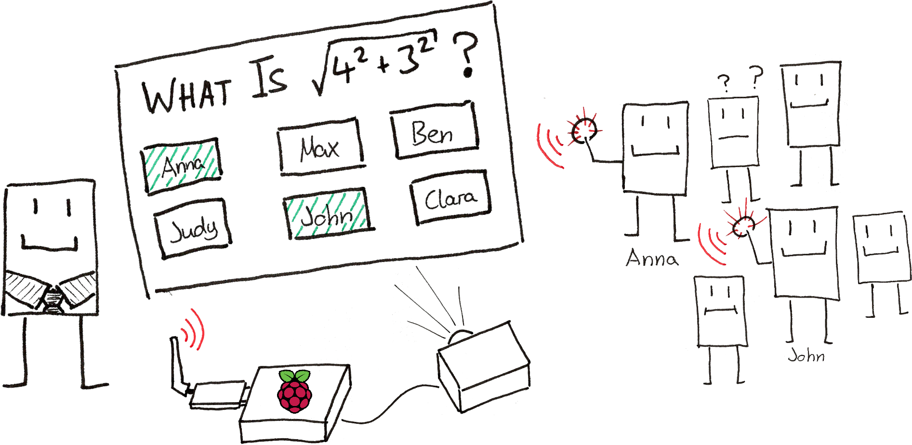

# Clickr

## About

**Designed to motivate: A student response system for schools.**



**For teachers:**
- Give oral grades based on the response data, rather than a gut feeling.
- Spend less time taking notes on student participation after or during each lesson.

**For students:**
- Motivation for participation: Immediately see how your oral grade improves.
- Continuously reflect on your participation.

## Getting started

To start your Phoenix server:

  * Install dependencies with `mix deps.get`
  * Create and migrate your database with `mix ecto.setup`
  * Start Phoenix endpoint with `mix phx.server` or inside IEx with `iex -S mix phx.server`

Now you can visit [`localhost:4000`](http://localhost:4000) from your browser.

Ready to run in production? Please [check our deployment guides](https://hexdocs.pm/phoenix/deployment.html).

## Remote iex
```sh
fly ssh console
> app/bin/clickr remote

# Reset database
>> Clickr.Release.rollback(Clickr.Repo, 0)
>> Clickr.Release.migrate
```

## Remote database
```sh
# credentials: Remote iex `System.get_env("DATABASE_URL")`
fly proxy 15432:5432 -a clickr-new-db
# jdbc:postgresql://localhost:15432/clickr_new
```

## Translate
  * `mix gettext.extract --merge --locale de`
  * `mix gettext.extract --merge --locale de`

## Learn more

  * Official website: https://www.phoenixframework.org/
  * Guides: https://hexdocs.pm/phoenix/overview.html
  * Docs: https://hexdocs.pm/phoenix
  * Forum: https://elixirforum.com/c/phoenix-forum
  * Source: https://github.com/phoenixframework/phoenix
