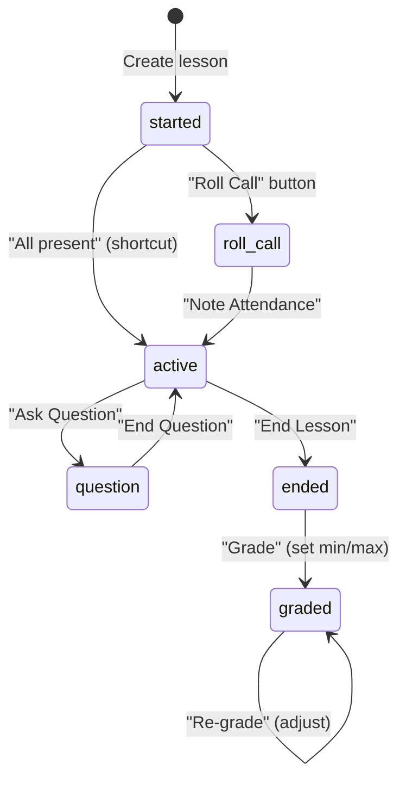

# Lesson Flow

## State Machine

## States in Detail

### started
- Initial state after lesson creation.
- Displays the seating plan grid with all student names.
- No attendance recorded yet.
- Actions: "Roll Call" (-> roll_call), "All present" (creates all lesson_students at once, -> active).

### roll_call
- The system listens for button click events for the teacher's user.
- When a student presses their physical button (or a keyboard key is pressed), the system maps button_id -> student_id via the button mapping, and creates a `LessonStudent` record.
- The student's seat turns green in real-time on the teacher's screen.
- Action: "Note Attendance" (stops listening, -> active).

### active
- The main teaching phase. All attending students are shown on the grid.
- Per-student points are displayed (accumulated from questions + extra_points).
- Teacher can manually: add/subtract points, add/remove students, register answers manually, add bonus grades.
- "Add point for all" gives every attending student +1 extra point.
- Actions: "Ask Question" (-> question), "End Lesson" (-> ended).

### question
- Created by transitioning from active with question parameters (name, points).
- The system listens for button clicks from attending students.
- When a student presses their button, a `QuestionAnswer` is created (one per student per question).
- Only attending students (in lesson_students) are eligible to answer.
- The teacher's UI shows answers appearing in real-time.
- Action: "End Question" (stops listening, marks question as ended, -> active).

### ended
- All questions are over. Teacher sees cumulative points per student.
- **Grading UI**: Two range sliders (min and max points). Moving them live-previews each student's grade on the grid.
- The grade is calculated using a linear scale: `percent = (student_points - min) / (max - min)`, clamped to [0, 1].
- Action: "Grade" (saves grade parameters, creates LessonGrade records for each student, triggers overall grade recalculation, -> graded).

### graded
- Same view as ended but with finalized grades shown.
- Can re-grade (adjust min/max and re-save, with confirmation prompt since it overwrites existing grades).
- German grade scale displayed per student (1+ through 6).
- Also shows cumulative subject grade percentage.

## Lesson Creation

When creating a lesson, the teacher selects:
- Subject
- Seating plan (determines the class and grid layout)
- Room (determines button-to-position mapping)
- Name (auto-generated as "ClassName SubjectName dd.mm.", editable)

A "recent combinations" feature shows the last 15 unique (subject, seating_plan, room) combos used. Clicking one instantly creates a new lesson with those settings.

## Grade Calculation (per lesson)

For each attending student:
1. Count total points = sum of (question.points for each question where student answered) + extra_points
2. Apply linear scale: `percent = (total_points - min) / (max - min)`
3. Clamp to [0.0, 1.0]
4. If min == max: percent = 0.0
5. If max < min: percent = 1.0
6. Save as LessonGrade

## Wheel of Fortune (Select Answer)

During the active state, if a question has been answered, the teacher can click "Select answer" to randomly select a student. The animation:
1. Takes ~50% of answering students randomly.
2. Creates a sequence of "steps" with exponentially increasing pause durations.
3. Highlights students one by one (yellow), faster to slower, landing on a final student (orange).

> **Reference (current implementation):** Roll call and question listening are implemented as OTP GenServers (`ActiveRollCall`, `ActiveQuestion`) that subscribe to button click events via Phoenix PubSub. They are managed through Registry + DynamicSupervisor. The wheel of fortune animation pushes steps to a JS hook via `push_event`.
